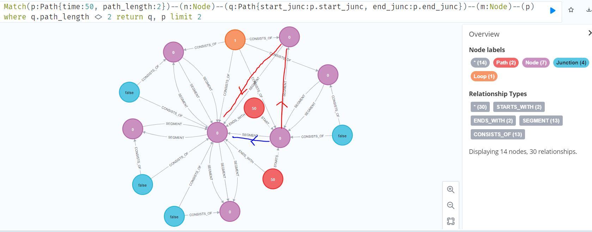

## Overview
This repository contains exemplary solutions for tasks from the practical course "Graphdatenbankpraktikum" at KIT. The main objective of this course was to get to know the graph database [Neo4j](https://neo4j.com/) and the query language [Cypher](https://neo4j.com/developer/cypher/), as well as performing computations on a provided database from material sciences.
In graph databases, data is stored in form of nodes and relationships, in contrast to tables in classic relational databases.
Cypher is a declarative query language for graphs, inspired by SQL, with the ability to follow paths in graphs using explicit graph patterns. Large and expensive joins can thus be avoided, but queries have to be formulated conciously to keep execution times low. 

### Database
The database we examined was the result of a simulation on displacements of atoms in metals. Atoms in metals form a lattice, which can easily be represented by a graph. When pressure is applied, they can change their positions, leading to curved displacements. For each timestamp in the simulation, a graph was created, documenting the behavior of the atoms over time.  Unfortunately, the database is no longer accessible to us.

## Exemplary query result

